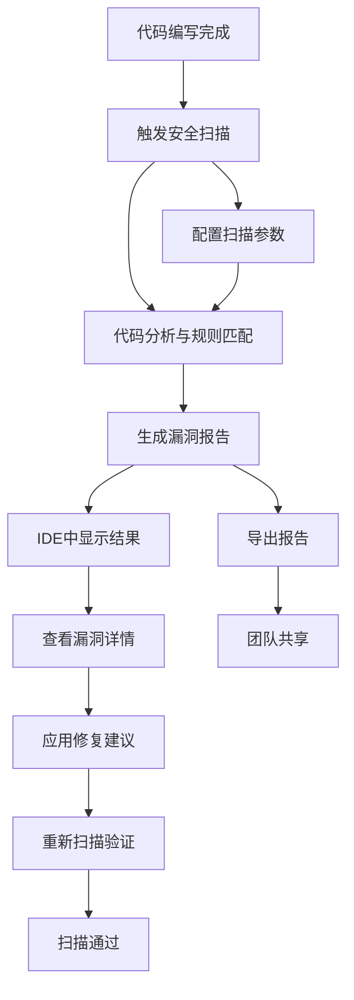

# 代码安全漏洞扫描插件 - 产品需求文档

## 1. 产品概述

代码安全漏洞扫描插件是一个集成到开发环境中的智能安全检测工具，能够在开发过程中实时或按需扫描代码，快速识别潜在的安全漏洞并提供修复建议。

该插件旨在帮助开发者在编码阶段就发现和修复安全问题，提升代码质量，降低生产环境安全风险，是DevSecOps实践的重要组成部分。

目标是成为开发者日常工作流中不可或缺的安全保障工具，覆盖主流编程语言和常见安全漏洞类型。

## 2. 核心功能

### 2.1 用户角色

| 角色 | 注册方式 | 核心权限 |
|------|----------|----------|
| 开发者 | IDE插件安装激活 | 可执行代码扫描、查看漏洞报告、获取修复建议 |
| 团队管理员 | 企业版授权 | 可配置扫描规则、管理团队扫描策略、查看团队安全报告 |

### 2.2 功能模块

我们的代码安全漏洞扫描插件包含以下主要功能模块：

1. **扫描控制台**：扫描配置、扫描执行、扫描历史管理
2. **漏洞报告页面**：漏洞详情展示、风险等级分类、修复建议
3. **规则配置页面**：扫描规则自定义、语言支持配置、忽略规则设置
4. **设置页面**：插件配置、通知设置、集成配置

### 2.3 页面详情

| 页面名称 | 模块名称 | 功能描述 |
|----------|----------|----------|
| 扫描控制台 | 快速扫描 | 一键扫描当前文件或项目，支持增量扫描和全量扫描 |
| 扫描控制台 | 扫描配置 | 选择扫描范围、扫描深度、排除目录等配置选项 |
| 扫描控制台 | 扫描历史 | 查看历史扫描记录、扫描结果对比、趋势分析 |
| 漏洞报告页面 | 漏洞列表 | 按风险等级分类显示漏洞，支持筛选和排序 |
| 漏洞报告页面 | 漏洞详情 | 显示漏洞代码位置、漏洞类型、影响范围、CVSS评分 |
| 漏洞报告页面 | 修复建议 | 提供具体的代码修复方案、最佳实践建议、参考链接 |
| 规则配置页面 | 规则管理 | 启用/禁用特定安全规则、自定义规则优先级 |
| 规则配置页面 | 语言支持 | 配置支持的编程语言和框架特定规则 |
| 规则配置页面 | 忽略设置 | 设置忽略特定文件、目录或漏洞类型 |
| 设置页面 | 通知配置 | 配置扫描完成通知、高危漏洞实时提醒 |
| 设置页面 | 集成设置 | 配置CI/CD集成、代码仓库集成、团队协作工具集成 |

## 3. 核心流程

**开发者使用流程：**
开发者在完成代码编写后，通过插件界面或快捷键触发扫描 → 插件分析代码文件并应用安全规则 → 生成漏洞报告并在IDE中高亮显示问题代码 → 开发者查看详细的漏洞信息和修复建议 → 根据建议修复代码并重新扫描验证。

**团队管理员配置流程：**
管理员登录插件管理界面 → 配置团队扫描策略和规则 → 设置扫描触发条件和通知规则 → 查看团队整体安全状况报告 → 根据报告调整安全策略。

## 4. 用户界面设计

### 4.1 设计风格

- **主色调**：深蓝色(#1E3A8A)作为主色，红色(#DC2626)表示高危漏洞，橙色(#EA580C)表示中危，绿色(#059669)表示安全状态
- **按钮样式**：现代扁平化设计，圆角按钮，悬停时有微妙的阴影效果
- **字体**：主要使用系统默认字体，代码区域使用等宽字体(Consolas, Monaco)
- **布局风格**：左侧导航栏 + 主内容区域，采用卡片式布局展示信息
- **图标风格**：使用线性图标风格，简洁明了，支持暗色和亮色主题

### 4.2 页面设计概览

| 页面名称 | 模块名称 | UI元素 |
|----------|----------|--------|
| 扫描控制台 | 快速扫描 | 大型扫描按钮(蓝色渐变)、进度条、扫描状态指示器、扫描范围选择器 |
| 扫描控制台 | 扫描历史 | 时间轴样式的历史记录、趋势图表、筛选器、导出按钮 |
| 漏洞报告页面 | 漏洞列表 | 分级颜色标识的漏洞卡片、严重程度徽章、快速筛选标签 |
| 漏洞报告页面 | 漏洞详情 | 代码高亮显示、侧边栏详情面板、修复建议折叠面板 |
| 规则配置页面 | 规则管理 | 开关切换器、规则分类标签、搜索框、批量操作按钮 |
| 设置页面 | 通知配置 | 通知类型复选框、频率滑块、测试通知按钮 |

### 4.3 响应式设计

插件主要面向桌面IDE环境，采用桌面优先的设计策略。界面支持IDE的亮色和暗色主题自动切换，确保在不同主题下都有良好的视觉体验。考虑到开发者可能使用不同尺寸的显示器，界面支持缩放和自适应布局。