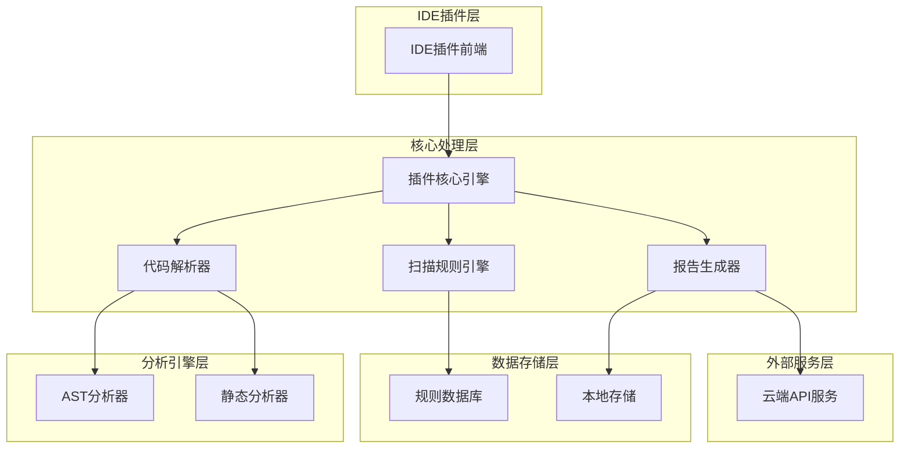
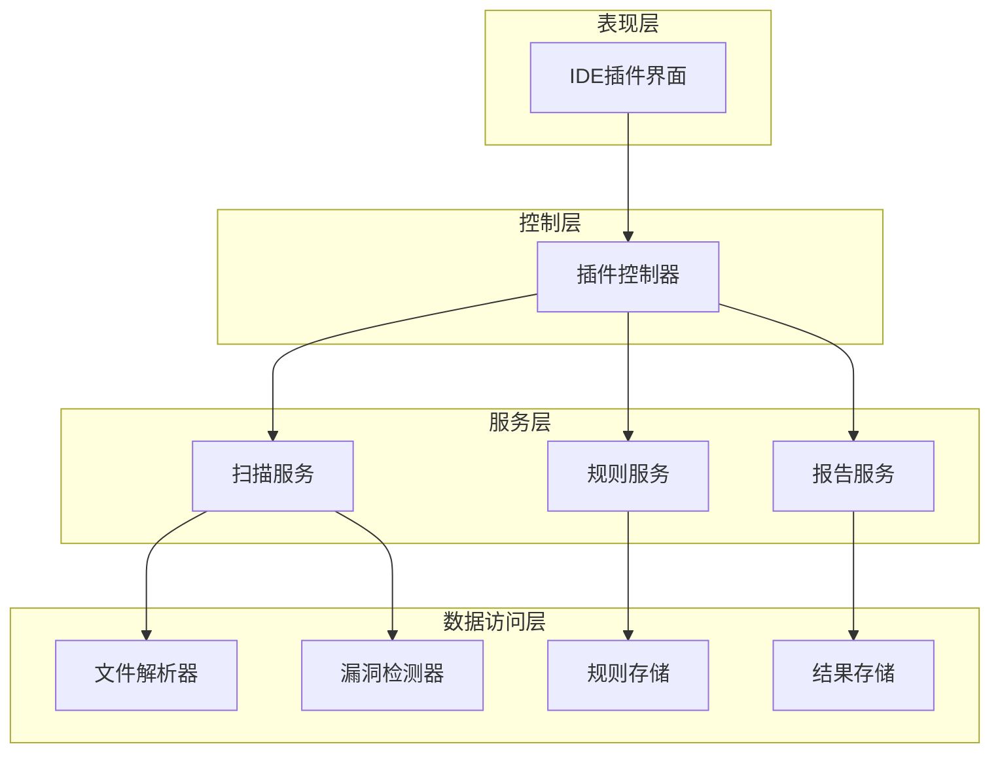
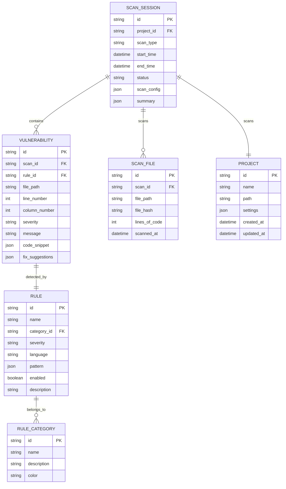

# 代码安全漏洞扫描插件 - 技术架构文档

## 1. 架构设计



## 2. 技术描述

- 前端：TypeScript + React + Electron (用于跨IDE支持)
- 核心引擎：Node.js + TypeScript
- 代码分析：Tree-sitter (多语言AST解析) + ESLint (JavaScript/TypeScript) + SonarJS规则引擎
- 数据存储：SQLite (本地规则和扫描历史) + IndexedDB (浏览器缓存)
- 外部集成：REST API + WebSocket (实时通知)

## 3. 路由定义

| 路由 | 用途 |
|------|------|
| /dashboard | 主控制台页面，显示扫描概览和快速操作 |
| /scan | 扫描执行页面，配置和启动代码扫描 |
| /reports | 漏洞报告页面，查看扫描结果和漏洞详情 |
| /rules | 规则配置页面，管理扫描规则和自定义配置 |
| /history | 扫描历史页面，查看历史扫描记录和趋势 |
| /settings | 设置页面，配置插件参数和集成选项 |

## 4. API定义

### 4.1 核心API

**代码扫描相关**
```
POST /api/scan/start
```

请求参数：
| 参数名称 | 参数类型 | 是否必需 | 描述 |
|----------|----------|----------|------|
| projectPath | string | true | 项目根目录路径 |
| scanType | string | true | 扫描类型：full/incremental/file |
| targetFiles | string[] | false | 指定扫描的文件列表 |
| ruleSet | string | false | 使用的规则集名称 |
| excludePaths | string[] | false | 排除的目录或文件路径 |

响应参数：
| 参数名称 | 参数类型 | 描述 |
|----------|----------|------|
| scanId | string | 扫描任务唯一标识 |
| status | string | 扫描状态：started/running/completed/failed |
| estimatedTime | number | 预估扫描时间（秒） |

请求示例：
```json
{
  "projectPath": "/path/to/project",
  "scanType": "incremental",
  "targetFiles": ["src/main.js", "src/utils.js"],
  "ruleSet": "security-standard",
  "excludePaths": ["node_modules", "dist"]
}
```

**漏洞报告相关**
```
GET /api/reports/{scanId}
```

响应参数：
| 参数名称 | 参数类型 | 描述 |
|----------|----------|------|
| scanId | string | 扫描任务ID |
| vulnerabilities | Vulnerability[] | 发现的漏洞列表 |
| summary | ScanSummary | 扫描结果摘要 |
| scanTime | string | 扫描完成时间 |

**规则管理相关**
```
GET /api/rules
POST /api/rules/custom
PUT /api/rules/{ruleId}/toggle
```

## 5. 服务架构图



## 6. 数据模型

### 6.1 数据模型定义



### 6.2 数据定义语言

**扫描会话表 (scan_sessions)**
```sql
-- 创建表
CREATE TABLE scan_sessions (
    id TEXT PRIMARY KEY,
    project_id TEXT NOT NULL,
    scan_type TEXT NOT NULL CHECK (scan_type IN ('full', 'incremental', 'file')),
    start_time DATETIME DEFAULT CURRENT_TIMESTAMP,
    end_time DATETIME,
    status TEXT NOT NULL DEFAULT 'pending' CHECK (status IN ('pending', 'running', 'completed', 'failed', 'cancelled')),
    scan_config TEXT, -- JSON格式的扫描配置
    summary TEXT, -- JSON格式的扫描摘要
    created_at DATETIME DEFAULT CURRENT_TIMESTAMP
);

-- 创建索引
CREATE INDEX idx_scan_sessions_project_id ON scan_sessions(project_id);
CREATE INDEX idx_scan_sessions_start_time ON scan_sessions(start_time DESC);
CREATE INDEX idx_scan_sessions_status ON scan_sessions(status);
```

**漏洞表 (vulnerabilities)**
```sql
-- 创建表
CREATE TABLE vulnerabilities (
    id TEXT PRIMARY KEY,
    scan_id TEXT NOT NULL,
    rule_id TEXT NOT NULL,
    file_path TEXT NOT NULL,
    line_number INTEGER NOT NULL,
    column_number INTEGER DEFAULT 0,
    severity TEXT NOT NULL CHECK (severity IN ('critical', 'high', 'medium', 'low', 'info')),
    message TEXT NOT NULL,
    code_snippet TEXT, -- JSON格式的代码片段
    fix_suggestions TEXT, -- JSON格式的修复建议
    status TEXT DEFAULT 'open' CHECK (status IN ('open', 'fixed', 'ignored', 'false_positive')),
    created_at DATETIME DEFAULT CURRENT_TIMESTAMP,
    FOREIGN KEY (scan_id) REFERENCES scan_sessions(id),
    FOREIGN KEY (rule_id) REFERENCES rules(id)
);

-- 创建索引
CREATE INDEX idx_vulnerabilities_scan_id ON vulnerabilities(scan_id);
CREATE INDEX idx_vulnerabilities_severity ON vulnerabilities(severity);
CREATE INDEX idx_vulnerabilities_file_path ON vulnerabilities(file_path);
CREATE INDEX idx_vulnerabilities_status ON vulnerabilities(status);
```

**规则表 (rules)**
```sql
-- 创建表
CREATE TABLE rules (
    id TEXT PRIMARY KEY,
    name TEXT NOT NULL,
    category_id TEXT NOT NULL,
    severity TEXT NOT NULL CHECK (severity IN ('critical', 'high', 'medium', 'low', 'info')),
    language TEXT NOT NULL,
    pattern TEXT NOT NULL, -- JSON格式的规则模式
    enabled BOOLEAN DEFAULT TRUE,
    description TEXT,
    created_at DATETIME DEFAULT CURRENT_TIMESTAMP,
    updated_at DATETIME DEFAULT CURRENT_TIMESTAMP,
    FOREIGN KEY (category_id) REFERENCES rule_categories(id)
);

-- 初始化数据
INSERT INTO rule_categories (id, name, description, color) VALUES
('sql-injection', 'SQL注入', '检测SQL注入漏洞', '#DC2626'),
('xss', '跨站脚本', '检测XSS漏洞', '#EA580C'),
('csrf', '跨站请求伪造', '检测CSRF漏洞', '#D97706'),
('auth', '身份认证', '检测认证相关漏洞', '#7C2D12'),
('crypto', '加密安全', '检测加密实现问题', '#1E40AF'),
('input-validation', '输入验证', '检测输入验证问题', '#059669');

INSERT INTO rules (id, name, category_id, severity, language, pattern, description) VALUES
('sql-injection-001', 'SQL注入检测', 'sql-injection', 'high', 'javascript', '{"type":"regex","pattern":"query\\s*\\+\\s*[\"\'][^\"\']*(\\$|\\+)"}', '检测字符串拼接形式的SQL查询'),
('xss-001', 'innerHTML XSS', 'xss', 'medium', 'javascript', '{"type":"ast","pattern":"MemberExpression[property.name=innerHTML]"}', '检测直接设置innerHTML可能导致的XSS'),
('weak-crypto-001', '弱加密算法', 'crypto', 'high', 'javascript', '{"type":"regex","pattern":"(MD5|SHA1)\\("}', '检测使用弱加密算法MD5或SHA1');
```